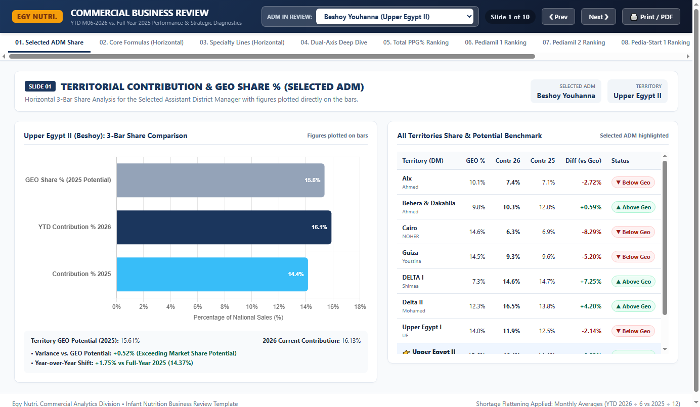
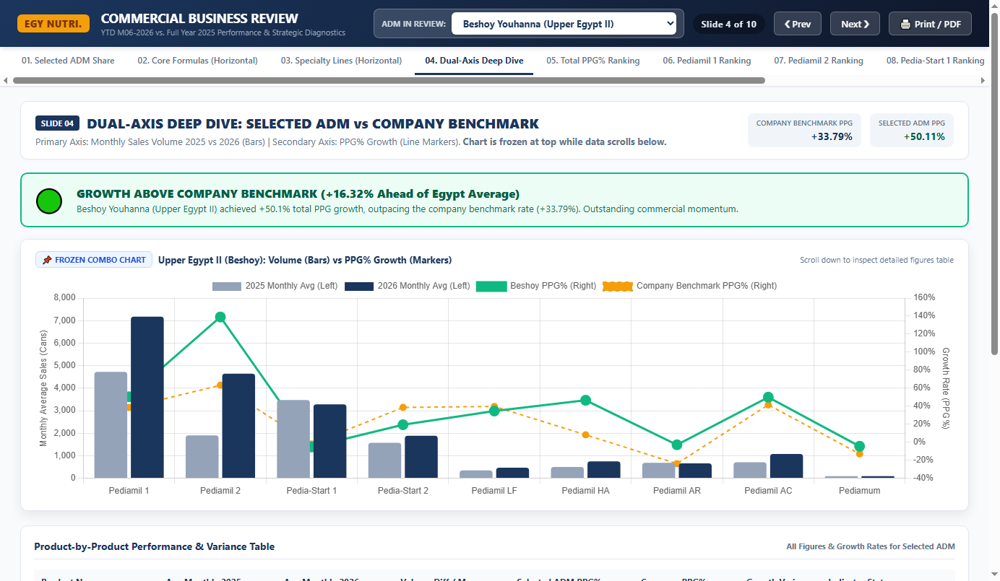
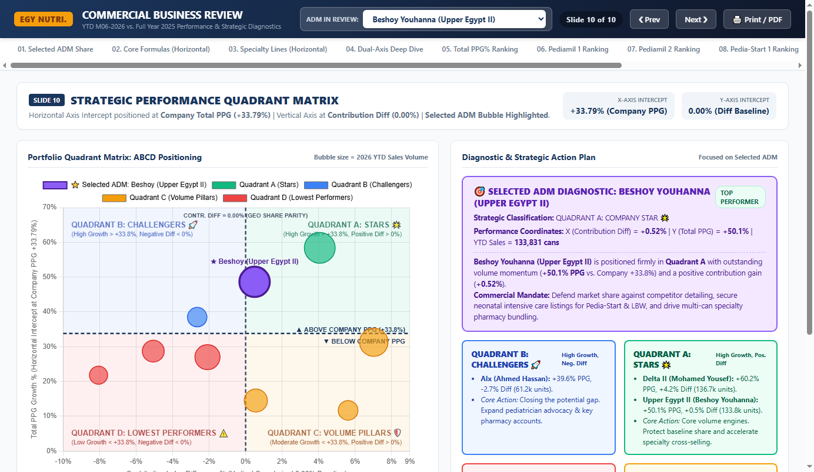

# Liptis Nutrition (Egy Nutri.) — Infant Nutrition Commercial Sales Review & Business Analytics

[](https://nodejs.org/)
[]()
[]()

Comprehensive commercial sales review, strategic performance matrix, and automated reporting system for **Liptis Nutrition / Egy Nutri.** infant nutrition portfolio across 9 Assistant District Managers (ADMs) and 11 SKUs.

---

## 📊 Executive Overview & Analytical Scope

- **Evaluation Window:** YTD June 2026 (M01–M06, 6 months) vs. Full Year 2025 (M01–M12, 12 months)
- **Territory Footprint:** 9 Assistant District Managers (ADMs) across Egypt:
  - *Alexandria, Behera & Dakahlia, Cairo, Guiza, DELTA I, Delta II, Upper Egypt I, Upper Egypt II, Kafr El-Sheikh*
- **Portfolio Categories:**
  - **Core Infant Nutrition:** Pediamil 1, Pediamil 2, Pedia-Start 1, Pedia-Start 2
  - **Specialty Nutrition:** Pediamil LF, Pediamil HA, Pediamil AR, Pediamil AC, Pediamum, Pediamil 3, LBW
- **Volume Metrics:**
  - **Total YTD 2026 Sales:** 829,882 cans (138,313.7 monthly average)
  - **Total 2025 Full-Year Sales:** 1,240,615 cans (103,384.6 monthly average)
  - **National Benchmark PPG% Growth:** **+33.79%**

---

## ⚖️ Methodological Standard: Supply Shortage Flattening Rule

Because of product stockouts and supply-chain shortages during 2025, comparing raw period totals would distort performance evaluation. To flatten the measurement baseline, all comparative analyses are conducted on **Monthly Sales Averages**:

$$\text{2026 Monthly Average} = \frac{\text{YTD M06-2026 Units}}{6}$$

$$\text{2025 Monthly Average} = \frac{\text{Full Year 2025 Units}}{12}$$

$$\text{PPG\% Growth Rate} = \left(\frac{\text{2026 Monthly Average}}{\text{2025 Monthly Average}} - 1\right) \times 100\%$$

$$\text{Line Average / ADM (LN AVG)} = \frac{\text{National Monthly Units}}{9 \text{ ADMs}}$$

---

## 📑 10-Slide Commercial Review Framework

| Slide | Topic | Visual Format & Analytical Focus |
| :---: | :--- | :--- |
| **01** | **Territorial Share Comparison** | Horizontal 3-bar comparison (*GEO Share Potential vs. 2026 Contribution vs. 2025 Contribution*) for the **Selected ADM in Review**, with exact percentages plotted on the bars and the national benchmark table beside it. |
| **02** | **Core Infant Nutrition** | Horizontal bars comparing *2026 MoAvg vs. 2025 MoAvg vs. Line Avg/ADM* for Pediamil 1, Pediamil 2, Pedia-Start 1, and Pedia-Start 2 with exact figures plotted directly on the bars. |
| **03** | **Specialty Nutrition Lines** | Horizontal bars comparing *2026 MoAvg vs. 2025 MoAvg vs. Line Avg/ADM* for Pediamil LF, HA, AR, AC, and Pediamum with on-bar data labels. |
| **04** | **Dual-Axis Deep Dive** | **Frozen/Sticky Combo Chart**: Primary Axis (Columns) displays Monthly Volume (2025 vs 2026), Secondary Axis (Lines) displays ADM PPG% vs. Company Benchmark (+33.79%). Dynamic Green/Red indicator box with detailed scrollable variance table. |
| **05** | **Total PPG% Ranking** | National leaderboard ranking all 9 ADMs against the Company Benchmark (+33.79%) at the top. Green bars for above benchmark ($\ge +33.8\%$), red bars for below ($< +33.8\%$). |
| **06** | **Pediamil 1 Ranking** | National leaderboard & performance table benchmarked against Company Pediamil 1 PPG (+39.92%). |
| **07** | **Pediamil 2 Ranking** | National leaderboard & performance table benchmarked against Company Pediamil 2 PPG (+65.26%). |
| **08** | **Pedia-Start 1 Ranking** | National leaderboard & performance table benchmarked against Company Pedia-Start 1 PPG (-2.06%). |
| **09** | **Pedia-Start 2 Ranking** | National leaderboard & performance table benchmarked against Company Pedia-Start 2 PPG (+39.86%). |
| **10** | **Strategic Quadrant Matrix** | 4-Quadrant Bubble Matrix ($X = \text{Contribution Diff}$ from 0.00% baseline, $Y = \text{Total PPG Growth}$ with horizontal intercept at Company Benchmark +33.79%). Bubble size proportional to sales volume. Features dynamic **Selected ADM diagnostic card** and strategic action plans. |

---

## 🧭 Strategic Performance Quadrant Matrix (ABCD Classification)

```
                     Total PPG Growth % (Y-Axis)
                                 ▲
                                 │
         QUADRANT B:             │          QUADRANT A:
   HIGH-GROWTH CHALLENGERS 🚀    │         COMPANY STARS 🌟
        (Alexandria)             │   (Delta II, Upper Egypt II)
   High Growth (≥ +33.8%)        │      High Growth (≥ +33.8%)
   Negative Contr. Diff (< 0%)   │      Positive Contr. Diff (≥ 0%)
                                 │
═════════════════════════════════╪═════════════════════════════════► +33.79% (Company PPG Intercept Line)
                                 │
         QUADRANT D:             │          QUADRANT C:
     LOWEST PERFORMERS ⚠️        │   VOLUME PILLARS & KEEPERS 🛡️
   (Cairo, Guiza, Upper Egypt I) │   (DELTA I, KFR EL.SHK, Behera)
   Sub-Benchmark Growth (< +33.8%)│   Moderate Growth (< +33.8%)
   Negative Contr. Diff (< 0%)   │   Positive Contr. Diff (≥ 0%)
                                 │
─────────────────────────────────┴─────────────────────────────────► Contribution Diff % (X-Axis)
                                 0.00% (GEO Parity Baseline)
```

- **Quadrant A — Stars 🌟:** Delta II (*Mohamed Yousef: +60.2% PPG, +4.20% Diff*), Upper Egypt II (*Beshoy Youhanna: +50.1% PPG, +0.52% Diff*). Volume powerhouses driving national expansion.
- **Quadrant B — High-Growth Challengers 🚀:** Alexandria (*Ahmed Hassan: +39.6% PPG, -2.72% Diff*). High momentum rapidly closing geographic potential gap.
- **Quadrant C — Volume Pillars & Share Keepers 🛡️:** DELTA I (*Shimaa Tarek: +32.2% PPG, +7.25% Diff*), Kafr El-Sheikh (*Karim Shehab: +12.0% PPG, +5.80% Diff*), Behera & Dakahlia (*Ahmed Sakr: +15.0% PPG, +0.59% Diff*). Strong market share defenders.
- **Quadrant D — Lowest Performers / Critical Turnaround ⚠️:** Cairo (*Noher Adel: +22.5% PPG, -8.29% Diff*), Guiza (*Youstina Farag: +29.6% PPG, -5.20% Diff*), Upper Egypt I (*UE North: +27.8% PPG, -2.14% Diff*). Trailing company pace with substantial market share deficits requiring urgent commercial intervention.

---

## 🖼️ Visual Previews

### Slide 01: Territorial Share Comparison (Selected ADM)


### Slide 04: Dual-Axis Frozen Deep Dive (Volume Bars & PPG% Lines)


### Slide 10: Strategic Performance Quadrant Matrix


---

## 📁 Repository Deliverables

| Deliverable File | Description |
| :--- | :--- |
| [**`Egy_Nutri_Business_Review.html`**](Egy_Nutri_Business_Review.html) | Standalone interactive dashboard with inlined Chart.js v4.4.1 (100% offline, zero network dependencies). Includes ADM dropdown selection, keyboard shortcuts, sticky frozen combo chart, and dynamic quadrant diagnostics. |
| [**`Egy_Nutri_Business_Review_Deck.pptx`**](Egy_Nutri_Business_Review_Deck.pptx) | 16:9 widescreen PowerPoint presentation featuring native editable Microsoft charts, dual-axis volume/growth combos, horizontal bars with on-bar data labels, and executive callout cards. |
| [**`Egy_Nutri_Sales_Analysis_Template.xlsx`**](Egy_Nutri_Sales_Analysis_Template.xlsx) | 13-sheet formatted Excel workbook with automated monthly average formulas, national rankings, line average quotas, and interactive manager deep-dive models. |
| **`data.js`** | Clean, structured dataset module containing raw 2026 YTD and 2025 sales figures across all 9 territories and 11 SKUs. |
| **`build_html.js`** | Node.js compiler script that embeds Chart.js and generates `Egy_Nutri_Business_Review.html`. |
| **`generate_pptx.js`** | Node.js automation script utilizing `pptxgenjs` to compile the PowerPoint presentation. |
| **`generate_excel.js`** | Node.js automation script utilizing `exceljs` to compile the Excel workbook. |

---

## 🚀 Getting Started & Regeneration

### Prerequisites
- [Node.js](https://nodejs.org/) (v18 or higher recommended)
- Modern web browser (Chrome, Edge, Firefox, Safari)

### Installation
```bash
# Clone the repository
git clone https://github.com/seifawamry/LN_Internal_Sales_Data.git
cd LN_Internal_Sales_Data

# Install dependencies
npm install
```

### Build & Regenerate Deliverables
```bash
# Rebuild all deliverables (HTML, PPTX, XLSX)
npm run build

# Or build individual components:
npm run build:html     # Compiles Egy_Nutri_Business_Review.html
npm run build:pptx     # Compiles Egy_Nutri_Business_Review_Deck.pptx
npm run build:excel    # Compiles Egy_Nutri_Sales_Analysis_Template.xlsx
```

---

## 🏢 Organization & Author
- **Organization:** Liptis Nutrition (LN) / Egy Nutri. Commercial Analytics Division
- **Repository:** [`seifawamry/LN_Internal_Sales_Data`](https://github.com/seifawamry/LN_Internal_Sales_Data)
- **Author:** Seif Elawamry
